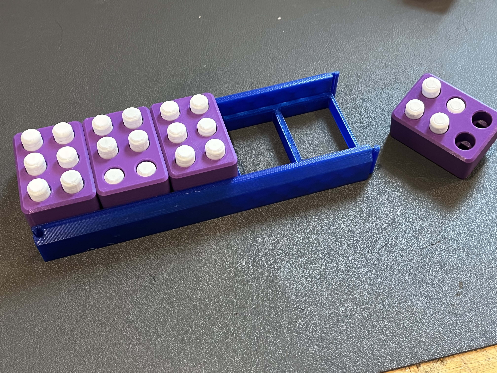

# Braille_Trainer

This project is used to fabricate large peg cells used to introduce braille. Each cell represents a letter and is placed within the holder rack.

This project is a remix from: [Braille Peg Cell by 3D Printy | Download free STL model | Printables.com](https://www.printables.com/model/146102-braille-peg-cell). Modifications designed by Noam Platt of [Make Good NOLA](https://makegood.design).

## Materials per cell
|Qty|Item|
|---|---|
|1|[Cell Case](stl/BRAILLE%20CELL%201%20with%20pocket%20v3.stl)|
|1|[Full Base](stl/0711%20base.stl) (6 cells), [Half Base](stl/0711%20half%20base.stl) (3 cells) or [5 cells](stl/NEW%20BASE%205%20CELLS%20WITH%20CONNECTOR.stl) (clip together)|
|12|[Button Caps](stl/Button%20Cap%20(1).stl)|
|6|[Springs](stl/NEW%20SPRING.stl)|

## Equipment
3D Printer

## Step #1: Print Settings
|Part Name|Material|Sizing|Infill|Support|Layer Height|
|---|---|---|---|---|---|
|Cell Case|PLA or ABS|100%|10%|No|.2 mm|
|Base|PLA or ABS|100%|10%|No|.2 mm|
|Button Cap|PLA or ABS|98%|10%|Skirt or Raft|.15 mm|
|Spring|TPU|100%|100% (solid)|no|.2 mm|

**Note:** also works well scaling everything down to 80% to make a smaller cell 

## Step #2: Assemble

1. Insert the spring into one cap.

2. Push the spring and cap through the case.

3. Insert another cap on the opposite side of the cell.

4. Repeat for the remaining 5 holes.
